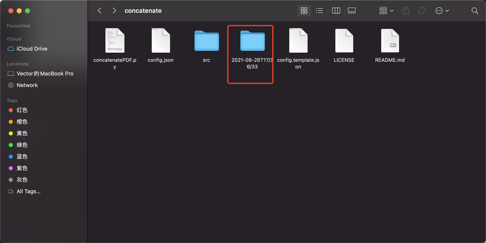
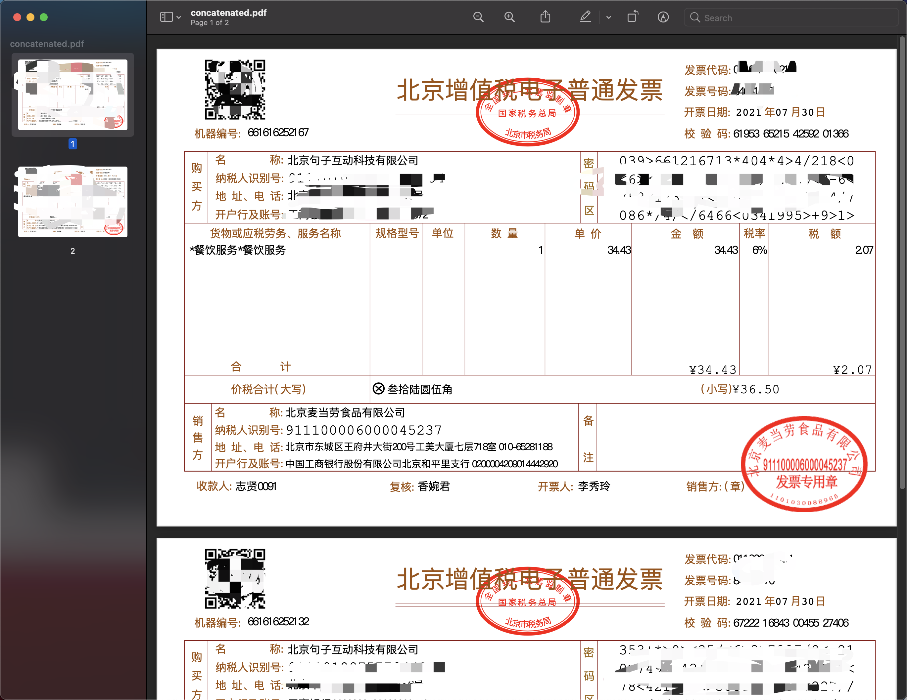
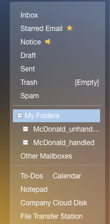
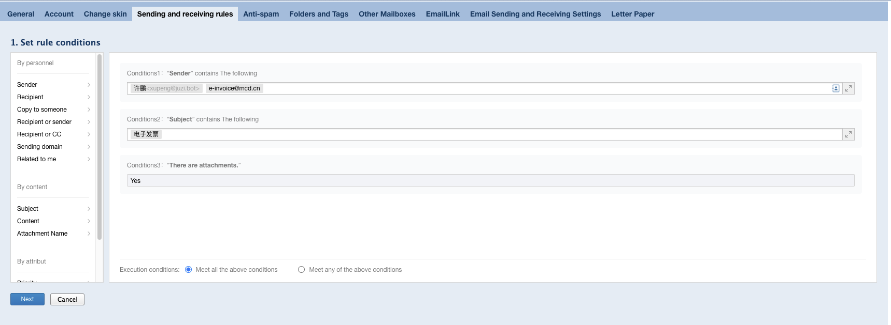
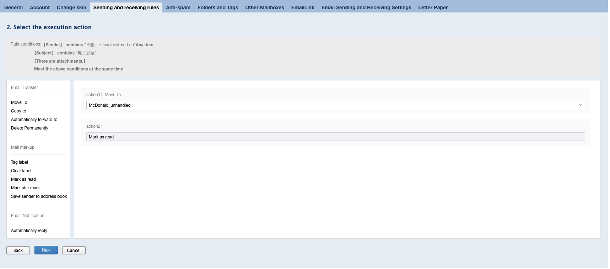
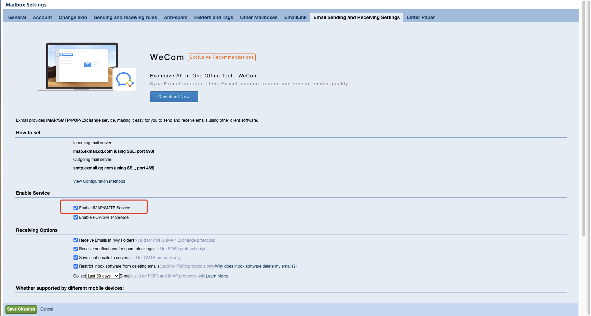
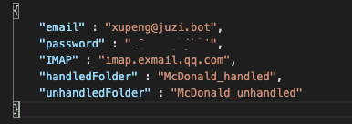

# concatenate
 Fetch McDonald invoices from mailbox and merge them to one PDF file.

## Description

This script will fetch all McDonald invoice pdfs from a pre-set email inbox folder and merge them into one. Mails fetched will be moved to another pre-set email folder.





## Dependence

```shell
pip3 install pypdf2
```

## Config

### email side

- Create two new folders under `My Folder`.

  One for handled invoice mails, one for the unhandled.

  Example: `McDonald_handled` and `McDonald_unhandled`.

  

- Create a receiving rule to automatically move McDonald invoice mails to unhandled folder.

  

  

- Make sure IMAP service is enabled.

  

### script side

- Rename `config.template.json` to `config.json`.

- Set `email`, `password`, `handleFolder`, `unhandledFolder` to your own preferences. If you are using other email service than `exmail.qq.com`, you are also obliged to set the proper `IMAP`.

  

## Run

cd to repository folder and run:

```shell
python3 concatenatePDF.py
```

## License

MIT
